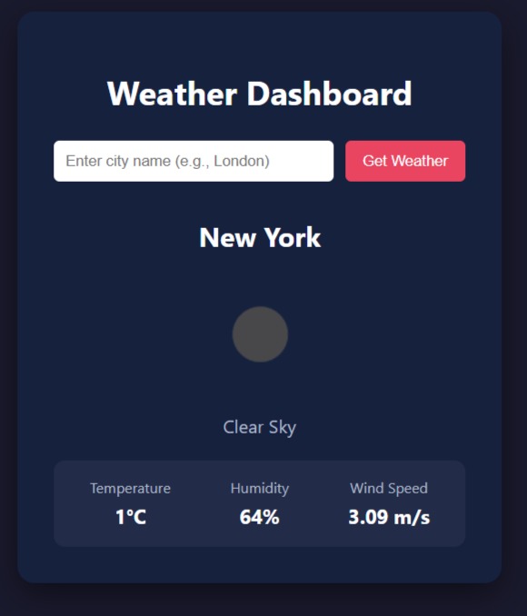
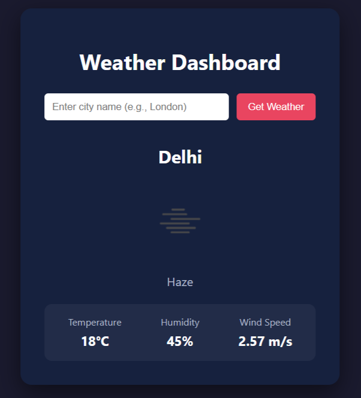

# Weather Information Dashboard 🌦️

A dynamic React application that provides real-time weather updates using the OpenWeatherMap API. This project demonstrates proficiency in managing **Side Effects** with `useEffect`, handling asynchronous API calls, and implementing proper cleanup mechanisms.

## 🚀 Features

-   **Real-Time Weather Data**: Fetches current temperature, humidity, wind speed, and weather conditions.
-   **Search Functionality**: Users can search for weather data by city name.
-   **Side Effect Management**:
    -   **`useEffect` Hooks**: Used for data fetching and setting up timers.
    -   **Dependency Arrays**: Optimization to ensure API calls occur only when necessary (e.g., when the city changes).
    -   **Cleanup Functions**: Implements `AbortController` to cancel stale requests and `clearInterval` to prevent memory leaks.
-   **Responsive Design**: A mobile-friendly dark-themed UI with hover effects and smooth transitions.
-   **Error Handling**: Graceful handling of invalid city names and network errors.

## 📂 Project Structure

```text
src/
├── components/
│   ├── WeatherSearch.js    # Search bar (Controlled Component)
│   └── WeatherDisplay.js   # Stateless component to render weather cards
├── WeatherDashboard.js     # Main logic, state, and useEffect implementation
├── App.js                  # App entry point
├── App.css                 # Custom CSS styling
└── index.js                # React DOM rendering

```

## 🛠️ Installation & Setup

1. **Clone the repository:**
```bash
git clone https://github.com/coderooz/-react-essentials-assignment.git
cd -react-essentials-assignment/weather-dashboard
```


2. **Install dependencies:**

```bash
npm install
```


3. **Configure API Key:**

* Open `src/WeatherDashboard.js`.
* Replace the placeholder key with your OpenWeatherMap API key:

```javascript
const API_KEY = 'YOUR_ACTUAL_API_KEY';
```

4. **Start the application:**

```bash
npm start
```


## 🧠 Technical Highlights (Assignment Requirements)

This project specifically focuses on React's lifecycle and side effects:

* **Mounting**: The app initializes with a default city ("New York") triggered by the initial run of `useEffect`.
* **Dependency Management**: The primary effect hook includes `[city]` in its dependency array. This ensures the API is called *only* when the user submits a new search, avoiding infinite loops.
* **Cleanup & Optimization**:
* **AbortController**: If a user searches for multiple cities rapidly, previous pending requests are cancelled to prevent race conditions (rendering the wrong city's data).
* **Timer Cleanup**: The auto-refresh interval is cleared using the return function of `useEffect` to prevent memory leaks when the component unmounts.


## 📸 Screenshots




## ☁️ Deployment

This project is optimized for deployment on platforms like Netlify or Vercel.

**Live Demo:** [https://weather-dashboard-swart-seven.vercel.app/](https://weather-dashboard-swart-seven.vercel.app/)

---

**Author:** Ranit Saha (**[Coderooz](https://www.coderooz.in)**)

**Tech Stack:** React, [OpenWeatherMap API](https://openweathermap.org/api), CSS3
